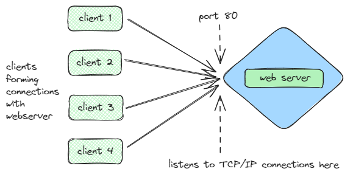
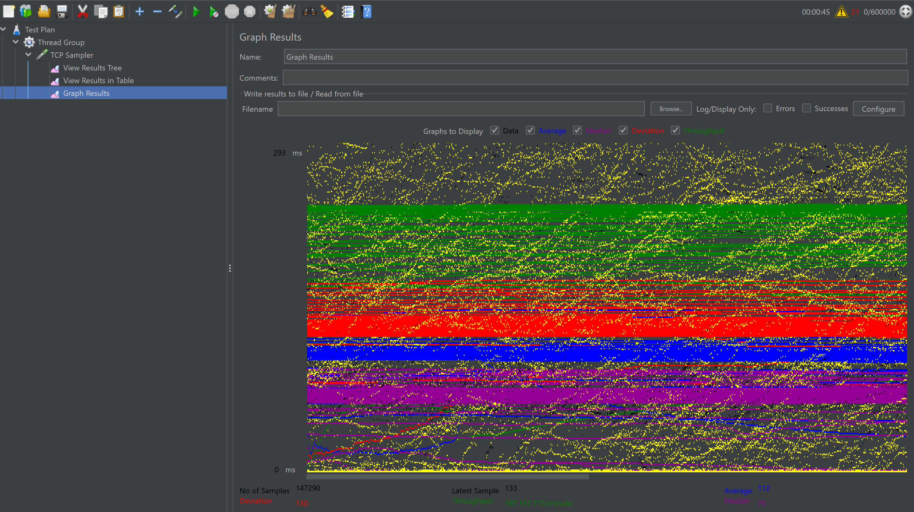
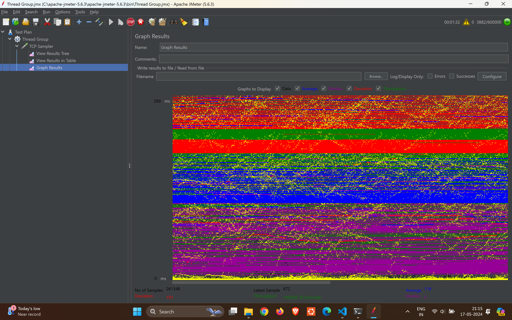
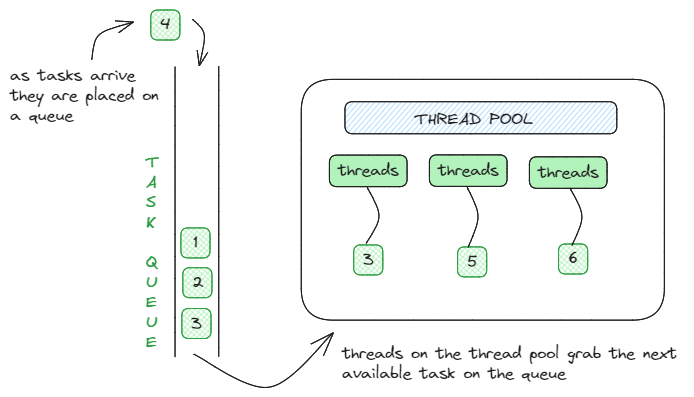
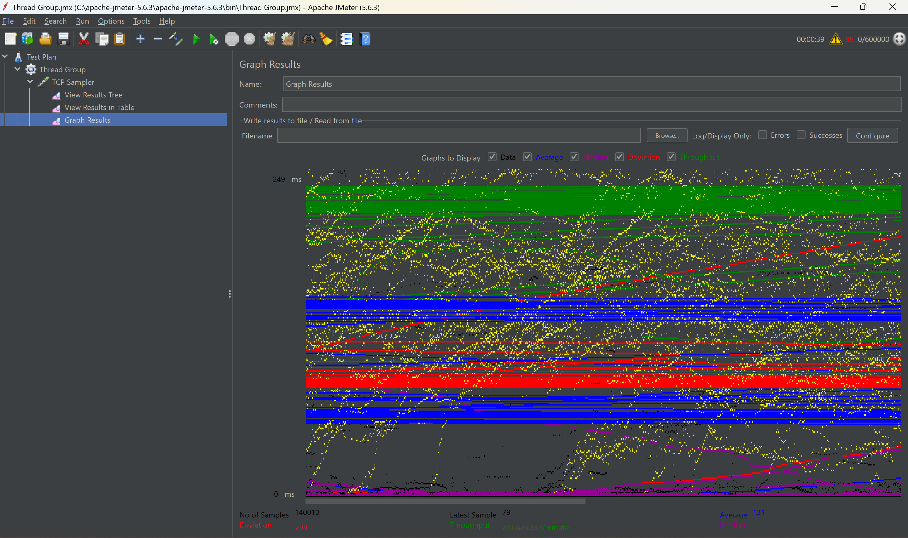

<center>

# ThreadWave🌊 (Built with Java)



**This repository showcases various implementations of Java web servers using different concurrency models: Single-Threaded, Multi-Threaded, and ThreadPool. These web servers are developed using Java's `ServerSocket` and `Socket` classes to handle client requests, and their performance is rigorously tested using Apache JMeter under various load conditions.**

> 💡 **Note:** Each web server model in this repository has been thoroughly tested by generating 600,000 requests. This extensive testing highlights the robustness and efficiency of each model under significant load.

</center>

## Single-Threaded Web Server
### Description

This is a basic web server implementation that handles one client at a time. It utilizes a single thread to manage each client request sequentially.

### Cons:

- Limited to handling one request at a time, which can lead to slow response times under heavy load.
- Not suitable for high traffic scenarios due to its sequential nature.

### Performance:

- Performance testing with Apache JMeter indicates limitations under heavy load. Here’s a graph depicting the results:

<center>

</center>

## Multi-Threaded Web Server
### Description 

This implementation enhances concurrency by creating a new thread for each client request, allowing multiple clients to be served simultaneously.

### Cons:

- High memory usage due to the creation of a new thread for each client request.
- Potential performance degradation if the number of threads grows too large.

### Performance:

- Performance testing with Apache JMeter shows improved concurrency but with increased resource usage. Here’s a graph illustrating the results:
<center>

</center>

## ThreadPool Web Server

<center>

</center>

### Description

This advanced implementation uses a fixed-size thread pool to manage client requests. The thread pool consists of a predetermined number of threads, efficiently handling client requests by reusing threads.

### Performance:

- Performance testing with Apache JMeter demonstrates excellent scalability and resource management. Here’s a graph showing the results:

<center>

</center>

## How to Run the Web Servers

### SingleThreaded, Multithreaded, and ThreadPool Web Server

```bash
javac Server.java
```

```bash
java Client.java
```

```bash
java Server
```
```bash
java Client
```

## Conclusion

- This repository contains implementations of Java web servers using different concurrency models: Single Threaded, Multithreaded, and ThreadPool.
- The web servers are implemented using Java's `ServerSocket` and `Socket` classes to handle client requests.
- The web servers are tested using JMeter to measure their performance under different loads.
- The SingleThreaded, Multithreaded, and ThreadPool web servers are compared based on their performance and efficiency under heavy traffic conditions.
- The ThreadPool web server is the most efficient and scalable solution for handling client requests under heavy traffic conditions.
